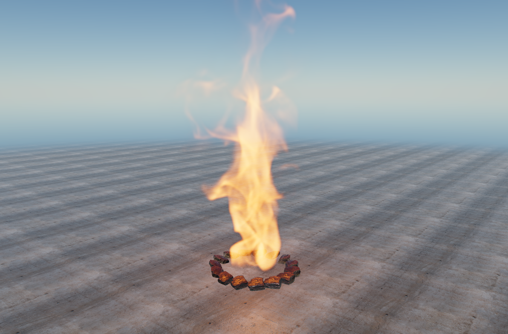
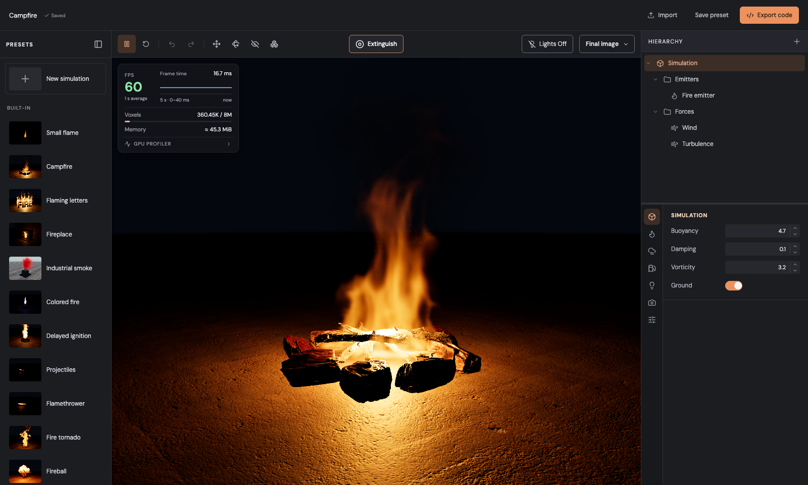
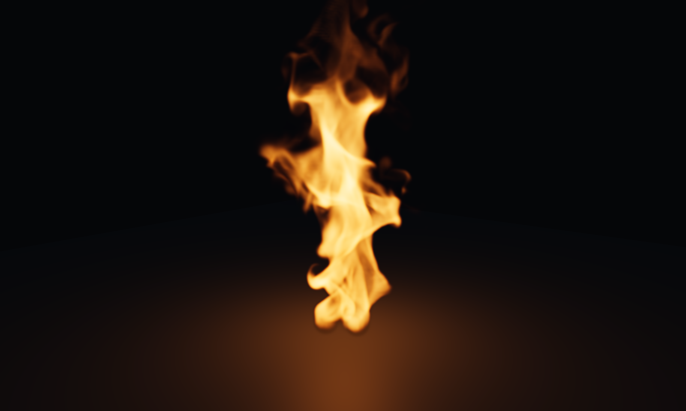

# Fire Pro

Real-time volumetric fire, smoke and explosions for [Three.js](https://threejs.org), simulated
and rendered on the GPU with WebGPU. Fire Pro has two parts: a library you can drop into any
`WebGPURenderer` scene, and a visual editor for designing effects and exporting them.



**[Open the editor in your browser](https://dgreenheck.github.io/threejs-fire-pro/)** (needs
WebGPU).

## Contents

- [Features](#features)
- [Requirements](#requirements)
- [Running the editor](#running-the-editor)
- [How a simulation is set up](#how-a-simulation-is-set-up)
  - [Scene](#scene)
  - [Simulation settings](#simulation-settings)
  - [Emitters](#emitters)
  - [Forces](#forces)
  - [Colliders](#colliders)
  - [Debug views and performance](#debug-views-and-performance)
- [Exporting](#exporting)
  - [Full app](#full-app)
  - [JSON and JavaScript configuration](#json-and-javascript-configuration)
- [Playing back a simulation in your own scene](#playing-back-a-simulation-in-your-own-scene)
- [Library API](#library-api)
- [Project structure](#project-structure)
- [Limitations](#limitations)
- [License](#license)

## Features

- **Sparse, unbounded grid.** The simulation runs in world space and only allocates voxels
  near emitters and visible flame, smoke and fuel, so effects can move around a large scene.
- **Fluid solver on the GPU.** Staggered velocity grid, pressure projection, buoyancy,
  vorticity confinement, MacCormack scalar transport and optional fuel combustion.
- **Volumetric rendering.** Ray-marched flame and smoke with blackbody flame color,
  self-shadowing smoke, depth-correct compositing with your scene, and an optional
  half-resolution mode.
- **Scene lighting.** Flames light nearby surfaces with point lights (one per emitter and per
  burning explosion with `ClusteredLighting`).
- **Emitters, explosions, forces and colliders** with an imperative API.
- **Editor.** Built-in presets, an object hierarchy, live inspector, transform gizmos, debug
  field views, GPU timings, undo/redo, local presets, and export to a standalone app, JSON or
  JavaScript.

## Requirements

- Node.js 20.19+ or 22.12+ (for the Vite dev server).
- A browser with WebGPU enabled, such as a recent version of Chrome, Edge or Safari.
- Three.js `0.185.1` (a peer dependency of the library).
- A discrete or recent integrated GPU. The effects are fill-rate and compute heavy.

## Running the editor

```sh
npm install
npm run dev
```

Open the printed URL (by default <http://127.0.0.1:5173>), or use the
[hosted editor](https://dgreenheck.github.io/threejs-fire-pro/). `npm run dev` first builds the
standalone runtime that the editor's **Full app** export bundles.



The editor has four areas:

| Area                  | What it does                                                                                                                                                                                                                                   |
| --------------------- | ---------------------------------------------------------------------------------------------------------------------------------------------------------------------------------------------------------------------------------------------- |
| **Presets** (left)    | Built-in effects, a blank **New simulation**, and presets you save yourself.                                                                                                                                                                   |
| **Hierarchy**         | The simulation and its emitters, forces and colliders. Use **+** to add objects; each row's menu renames, duplicates or deletes it.                                                                                                            |
| **Viewport** (center) | Orbit with the mouse. Click an emitter's wireframe guide to select it. The toolbar plays, pauses, restarts, undoes and redoes, switches move and rotate gizmos, shows the solver's bricks, turns the lights on or off, and picks a debug view. |
| **Inspector** (right) | Settings in tabs along its right edge: the simulation-wide tabs, and a tab for the selected emitter, force or collider. Hover a label for a short description.                                                                                 |

Your work is saved in the browser as a draft automatically. **Save preset** stores it in your
preset list, **Import** opens an exported ZIP, `simulation.js` or `simulation.json`, and
**Export code** downloads it (see [Exporting](#exporting)).

To make a production build of the editor and the example, run `npm run build`; the output
goes to `dist/`. Set `BASE_PATH` to serve it from a subfolder. Every push to `main` builds the
editor with `BASE_PATH=/threejs-fire-pro/` and deploys it to GitHub Pages
([`.github/workflows/pages.yml`](.github/workflows/pages.yml)).

## How a simulation is set up

Everything you author in the editor is one document: a preview **scene**, the **camera**, the
**simulation** settings, and lists of **emitters**, **forces** and **colliders**. All positions
are in meters, in world space, with the ground at `y = 0`.

```text
Simulation document
├── scene        preview world: built-in scene and lights
├── camera       starting camera position and target
├── simulation   grid, flame, smoke, motion, fuel, lighting and rendering settings
├── emitters[]   continuous sources and bursts
├── forces[]     wind, turbulence, vortex and radial fields
└── colliders[]  spheres and boxes the flow goes around
```

### Scene

The scene is the world around the effect. Each built-in preset has its own scene (a campfire
ring, a fireplace, a flamethrower nozzle, …), and **New simulation** starts with an empty floor.
The **Lights** button at the top right of the viewport turns the sky, sun and fill lights on or
off. The editor remembers your choice, except that smoke-only presets always open lit. Lights
don't change the simulation; they only change what it is shown against. Some built-in scenes
also add behavior, like the flamethrower's sweeping nozzle or the projectile launcher, and
their props act as colliders.

### Simulation settings

The inspector's simulation tabs hold the settings that apply to the whole effect:

| Tab            | Settings                                                                                                                                                                                                                                                                                                                                                                                                |
| -------------- | ------------------------------------------------------------------------------------------------------------------------------------------------------------------------------------------------------------------------------------------------------------------------------------------------------------------------------------------------------------------------------------------------------- |
| **Simulation** | `buoyancy`, `damping` and `vorticity`, and a solid `ground`.                                                                                                                                                                                                                                                                                                                                            |
| **Flame**      | Flame `lifespan`, the heat, smoke and expansion it produces, and `cooling`.                                                                                                                                                                                                                                                                                                                             |
| **Smoke**      | `dissipation` and `smokeWeight` (shown as **Weight**).                                                                                                                                                                                                                                                                                                                                                  |
| **Fuel**       | Optional combustion: fuel the flow carries, which ignites above `ignitionHeat` and burns at `burnRate`.                                                                                                                                                                                                                                                                                                 |
| **Lighting**   | Whether flames light the scene (`illuminateScene`) and how strongly.                                                                                                                                                                                                                                                                                                                                    |
| **Rendering**  | The flame's look (`color`, `brightness`, `opacity`, blackbody `temperature`, `sootGlow`) and the smoke's (`color`, `density`, `scattering`, `shadowDensity`).                                                                                                                                                                                                                                           |
| **Quality**    | `voxelSize` (meters per cell), the voxel budget (`grid.maxVoxels`), the density `cutoff` below which cells are released, **Fine Detail** (MacCormack transport), brick size, the velocity and smoke grid resolutions relative to `voxelSize`, and the render settings: reconstruction `filter`, `raySteps`, `lightingDivisor` and `halfResolution`. Changing the grid settings restarts the simulation. |

Smaller voxels look more detailed and cost more: halving `voxelSize` means up to eight times
as many cells for the same volume.

### Emitters

Emitters add flame, heat, smoke and fuel to the simulation. Each emitter has a position and
rotation, which you can set in the inspector or with the viewport gizmos, and a **mode**:

- **Continuous** emitters add their emission every second while **Emitting** is on.
  - **Shape**: `sphere` (with a radius), `box` (with a size), `disk` or `torus` (with a radius,
    lying flat). The Flaming letters scene also offers a `letters` shape.
  - **Emission**: `flame` (0–1, how fresh the flame it lights is), and `heat`, `smoke` and
    `fuel` rates per second.
  - **Launch velocity**: an optional direction and speed that pushes what the emitter adds,
    turned with the emitter. This is how the flamethrower and jets work.
- **Burst** emitters release a single charge each time they are triggered: an explosion.
  They have a burst `radius`, the `flame`, `heat`, `smoke` and `fuel` per burst, an
  `outwardSpeed`, and a noise `variation` that makes the burst uneven. Use **Detonate** in the
  viewport toolbar, or the button in the emitter's **Burst** section, to trigger one.

### Forces

Forces accelerate the flow. Add them from the hierarchy's **+** menu:

| Force          | Settings                                                                                                |
| -------------- | ------------------------------------------------------------------------------------------------------- |
| **Wind**       | `direction` and `strength` in m/s².                                                                     |
| **Turbulence** | `strength` and `scale` (higher scale makes smaller eddies).                                             |
| **Vortex**     | `center`, `axis`, tangential `strength` (negative reverses), `radius`, upward `lift` and `inward` pull. |
| **Radial**     | `center`, `strength` (positive pushes outward, negative pulls in) and `radius`.                         |

Under **Apply to**, a force acts on the whole simulation or only around the continuous
emitters you pick. Selecting a force highlights the emitters it affects; wind and vortex forces
also show an arrow for their direction or axis.

### Colliders

Colliders are spheres and boxes that fire and smoke flow around. Add one from the **+** menu and
set its shape, size and transform. The library also supports closed triangle meshes as
colliders (see [Library API](#library-api)).

### Debug views and performance

The **View** menu in the viewport toolbar replaces the final image with one simulation field:
smoke, heat, flame lifetime, flame glow, fuel, velocity, vorticity, expansion, pressure or divergence,
with a color legend. **Simulation bricks** outlines the parts of the grid the solver is
computing. The performance overlay in the viewport shows the frame rate, active voxels against
the budget and estimated GPU memory, and can expand into per-pass GPU timings.

## Exporting

Click **Export code** to take an effect out of the editor. There are three formats.

### Full app

**Full app** downloads a ZIP with a ready-to-serve page:

```text
my-effect.zip
├── index.html               page with play, pause, restart and effect buttons
├── app.js                   starts the runtime and wires up the buttons
├── simulation.js            your configuration
├── runtime.js               the editor's runtime: Three.js, Fire Pro and the preview scenes
├── README.txt
└── THIRD_PARTY_NOTICES.md
```

Unzip it, serve the folder with any static HTTP server, and open it in a WebGPU browser:

```sh
npx serve my-effect
```

The app shows the effect in the same scene and camera as the editor. You can re-import the
ZIP into the editor to keep working on it.

### JSON and JavaScript configuration

**JSON** downloads `simulation.json`, and **JavaScript** downloads `simulation.js`, which is the
same object as `export const simulation = { ... };`. Both can be imported back into the editor,
and both hold the complete document:

```jsonc
{
  "format": "fire-pro",
  "version": 11,
  "id": "982969f4-67d2-447f-a379-53d4c6b23881",
  "name": "Fire tornado",
  "scene": { "recipe": "fire-tornado", "sky": true },
  "camera": { "position": [10, 7, 12], "target": [0, 4.2, 0] },
  "simulation": {
    "voxelSize": 0.05,
    "brickSize": 16,
    "velocityDivisor": 2,
    "smokeDivisor": 2,
    "scalarMacCormack": true,
    "seed": 1,
    "grid": { "maxVoxels": 8000000, "cutoff": 0.05, "ground": true },
    "flame": { "lifespan": 2.8, "heatRate": 8, "smokeRate": 0.2, "cooling": 0.3, "temperature": 2600, ... },
    "smoke": { "dissipation": 0.35, "color": "#25292e", "density": 1.2, ... },
    "motion": { "buoyancy": 1.8, "smokeWeight": 0.12, "damping": 0.12, "vorticity": 4.2 },
    "fuel": { "enabled": false, "ignitionHeat": 0.5, "burnRate": 4 },
    "lighting": { "illuminateScene": true, "intensity": 2 },
    "rendering": { "filter": "quadratic", "raySteps": 128, "halfResolution": true, "lightingDivisor": 4 }
  },
  "emitters": [
    {
      "id": "54098c84-51e3-42d4-a0d6-fe99440395bd",
      "name": "Ground fire 1",
      "mode": "continuous",
      "shape": "sphere",
      "radius": 0.44,
      "size": [2.1, 0.12, 2.1],
      "position": [0.585, 0.45, 0],
      "rotation": [0, 0, 0],
      "options": {
        "active": true,
        "emission": { "flame": 1, "heatRate": 22, "smokeRate": 0.02, "fuelRate": 0 },
        "velocity": { "direction": [0, 0.545, 0.838], "speed": 5 }
      },
      "burst": { "radius": 0.5, "charge": { ... }, "outwardSpeed": 8, "variation": { ... } }
    },
    ...
  ],
  "forces": [
    {
      "id": "728963f1-d0fe-41af-bcb6-22cebb6301a8",
      "name": "Rotating updraft",
      "options": { "type": "vortex", "center": [0, 0.45, 0], "axis": [0, 1, 0], "strength": 16, "radius": 1.35, "lift": 8.5, "inward": 6, "active": true },
      "targets": null
    },
    ...
  ],
  "colliders": []
}
```

The `simulation` object is exactly the `SimulationOptions` the library takes, and each
emitter's `options` and `burst` are exactly its `EmitterOptions` and `ExplosionOptions`. Rotations
are stored in radians (the inspector shows degrees). Every emitter keeps both its continuous
settings and its `burst` settings, but only the ones for its `mode` are used. `targets` is
`null` for a force that acts everywhere, or a list of emitter IDs.

## Playing back a simulation in your own scene

The configuration maps directly onto the library, so you can play an exported effect in any
Three.js WebGPU scene. [`examples/playback`](examples/playback/main.ts) does exactly that: it
loads a `simulation.json` exported from the editor's Fire tornado preset and rebuilds its
emitters, forces and colliders. Run `npm run dev` and open
<http://127.0.0.1:5173/examples/playback/>. Press <kbd>Space</kbd> to fire burst emitters again.



The core of it:

```ts
import * as THREE from 'three/webgpu';
import { ClusteredLighting } from 'three/addons/lighting/ClusteredLighting.js';
import { FireSimulation } from 'threejs-fire-pro';

const config = await (await fetch('./simulation.json')).json();

// Set up the renderer, scene, camera and a THREE.Timer as usual.
const renderer = new THREE.WebGPURenderer({ antialias: true });
renderer.lighting = new ClusteredLighting(); // flame lights without material recompiles
await renderer.init();

// Simulation-wide settings: grid, flame, smoke, motion, fuel, lighting, rendering.
const simulation = new FireSimulation(config.simulation);
scene.add(simulation); // keep its transform at the identity: it runs in world space

const emitters = new Map();
const explosions = [];
for (const source of config.emitters) {
  if (source.mode === 'burst') {
    const explosion = simulation.addExplosion(source.burst);
    explosion.object.position.fromArray(source.position);
    explosions.push(explosion);
  } else {
    // Sphere emitters; box, disk and torus emitters use a mesh shape (see the example).
    const emitter = simulation.addEmitter({
      ...source.options,
      shape: { type: 'sphere', radius: source.radius },
    });
    emitter.object.position.fromArray(source.position);
    emitter.object.rotation.fromArray(source.rotation);
    emitters.set(source.id, emitter);
  }
}
for (const force of config.forces)
  simulation.addForce(
    force.options,
    force.targets?.map((id) => emitters.get(id)),
  );

await simulation.initialize(renderer);
explosions.forEach((explosion) => explosion.trigger()); // trigger again whenever it should go off

renderer.setAnimationLoop((time) => {
  timer.update(time);
  simulation.update(timer.getDelta()); // fixed 1/60 s steps, at most one per call
  renderer.render(scene, camera);
});
```

The example imports the library from `src/`. To use Fire Pro from another project, build it
with `npm run build:lib`, which writes an ES module and type declarations to `dist-lib/`, or
run `npm pack` to make an installable package.

## Library API

```ts
const simulation = new FireSimulation(options?: SimulationOptions);
await simulation.initialize(renderer);   // once, with the WebGPURenderer that draws it
simulation.update(deltaSeconds);         // every frame
```

| Member                                 | Description                                                                                                                                            |
| -------------------------------------- | ------------------------------------------------------------------------------------------------------------------------------------------------------ |
| `addEmitter(options)`                  | A continuous source. `shape` is `{ type: 'sphere', radius }` or `{ type: 'mesh', object }`.                                                            |
| `addFire` / `addFlameJet` / `addSmoke` | `addEmitter` with defaults tuned for a fire, a fast jet or a smoke source.                                                                             |
| `addExplosion(options)`                | A burst source. Call `trigger()` on it to release a charge, optionally at `{ worldPosition }`.                                                         |
| `addForce(options, targets?)`          | A wind, turbulence, vortex or radial force, everywhere or around the given emitters.                                                                   |
| `addCollider({ object, shape })`       | A sphere, box or closed triangle-mesh collider that follows `object`'s transform.                                                                      |
| `configure(patch)`                     | Change any setting except `voxelSize`, `brickSize`, `velocityDivisor`, `smokeDivisor`, `scalarMacCormack` and `seed`, without clearing the simulation. |
| `debug({ field, bricks })`             | Show a single field instead of the final image, or outline the active bricks.                                                                          |
| `reset()`                              | Clear all flame, smoke and fuel.                                                                                                                       |
| `stats`                                | Simulated time, dropped time, active voxels, whether the voxel budget was hit, estimated memory.                                                       |
| `dispose()`                            | Release all GPU resources.                                                                                                                             |

Emitters, explosions, forces and colliders are handles: each has `configure(patch)`,
`getOptions()` and `remove()`, and emitters also have `start()` and `stop()`. Move an emitter or
explosion through its `object` (an `Object3D`), or move the mesh of a mesh emitter or collider.
Every option is documented in [`src/library/options.ts`](src/library/options.ts).

## Project structure

```text
src/                 the library
  library/           public API: FireSimulation, handles, options, scene rendering and lights
  engine/            GPU fluid solver, sparse tile allocation, pressure solver, volume lighting
  engine/shaders/    WGSL compute and render shaders
editor/              the editor (React)
  presets/           built-in presets, in the exported JSON format
  scenes/            preview scenes for the presets, and their models and textures
examples/playback/   play an exported configuration with the library
public/              editor thumbnails and icon
```

## Limitations

- **WebGPU only.** Fire Pro needs `THREE.WebGPURenderer` running its WebGPU backend. There is
  no WebGL fallback.
- **Performance depends heavily on the GPU.** Simulation cost grows with active voxels, and
  rendering cost with screen coverage. Large, fine-voxel effects can be too slow on integrated
  GPUs. `halfResolution`, a coarser `voxelSize`, a coarser velocity grid and fewer `raySteps`
  are the main levers.
- **Fixed time step.** The solver advances in 1/60 s steps and runs at most one step per
  `update()`. When frames take longer than that, the effect slows down instead of skipping
  ahead.
- **Voxel budget.** When the content needs more cells than `grid.maxVoxels`, the cells past the
  budget stay empty, so wide or long-lived smoke can be clipped.
- **World space.** The `FireSimulation` object must stay at the identity transform, and the
  optional solid ground is fixed at `y = 0`.
- **Depth.** Reversed and logarithmic depth buffers aren't supported. The volume is composited
  against the depth of your opaque geometry and isn't depth-sorted with other transparent
  objects.
- **Mesh emitters and colliders** must be rigid, non-instanced meshes without morph targets or
  skinning. Mesh colliders must also be closed, consistently wound surfaces, and have to be
  removed and added again after their geometry changes.
- **Art-directed, not physically accurate.** Heat is a relative quantity that drives buoyancy
  and ignition, not a temperature. Flame color comes from a blackbody curve, but combustion is
  a simple fuel model tuned for appearance.
- **The editor's scenes are built in.** You can't import your own models into the editor's
  preview, and the **Full app** export always uses the built-in scene for its preset. To place
  an effect in your own world, export the configuration and use the library, as in the playback
  example.
- **One renderer per simulation.** A `FireSimulation` is tied to the renderer it was
  initialized with.

## License

Fire Pro is released under the [MIT License](LICENSE). Bundled fonts, models and textures have
their own licenses, listed in [THIRD_PARTY_NOTICES.md](THIRD_PARTY_NOTICES.md).
